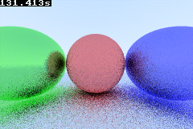

# GBA RT

Raytracing for the gba. to compile you just need `cargo` with the `nightly` compiler installed via rustup, as well as `agb-gbafix` (`cargo install agb-gbafix`)



## Compiling

on linux you can use the makefile to compile with `make fix` assuming `make` is installed as well

you can also use `make run` to run in `mgba-qt` or `make run_mesen` to run in `mesen2`

## Compiling on Windows or without make

```sh
cargo build --release
agb-gbafix target/armv4t-none-eabi/release/gba-rt -o gba-rt.gba
```

then run in your favorite emulator (i recommend mesen2)

## A note

While this is a CC0 project, i do kindly ask you add attribution. I cannot force you of course, but i will trust you to make whatever decision you see fit. If this helps you, consider making a pr with your improvements, to keep this a free resource for everyone!

### Some Credits

- [Zesterer](https://github.com/zesterer) for helping with finding inefficiencies as well as pointing out helpful libs and pushing me to better my code, as well as helping with a few implementations and some bug fixes
- [gbadev](https://gbadev.net/) (mainly the discord) users for helping keep me motivated to work on it and helping with some bugs

## Old readme

> # AGBRS template
>
> ## A basic template example for agb projects
>
> This makes getting started with a new project for the Game Boy Advance in rust really simple, by providing
> all the boiler plate files for you.
>
> ## Building
>
> ### Prerequisites
>
> You will need the following installed in order to build and run this project:
>
> * A recent version of `rustup`. See the [rust website](https://www.rust-lang.org/tools/install) for instructions for your operating system
>
> You will also want to install an emulator. The best support in agb is with [mgba](https://mgba.io), with
> `println!` support via `agb::println!` but any emulator should work. You'll get the best experience if
> `mgba-qt` is in your `PATH`.
>
> If you want to run your game on real hardware, you will also need to install `agb-gbafix` which you can do after installing
> rust with the following: `cargo install agb-gbafix`. This is not required if you are only running your game in an emulator.
>
> ### Running in an emulator
>
> Once you have the prerequisites installed, you should be able to build using
>
> ```sh
> cargo build
> ```
>
> or in release mode (recommended for the final version to ship to players)
>
> ```sh
> cargo build --release
> ```
>
> The resulting file will be in `target/thumbv4t-none-eabi/debug/<your game>` or `target/thumbv4t-none-eabi/release/<your game>` depending on
> whether you did a release or debug build.
>
> If you have `mgba-qt` in your path, you will be able to run your game with
>
> ```sh
> cargo run
> ```
>
> or in release mode
>
> ```sh
> cargo run --release
> ```
>
> ## Starting development
>
> You can find the documentation for agb [here](https://docs.rs/agb/latest/agb/).
>
> You may also want to change the package name and version in `Cargo.toml` before you start.
>
> ## Shipping a .gba file for real hardware
>
> To make a game run on real hardware, you will need to convert the built file into a file suitable for
> running on the real thing.
>
> First build the binary in release mode using the instructions above, then do the following:
>
> ```sh
> agb-gbafix target/thumbv4t-none-eabi/release/<your game> -o <your game>.gba
> ```
